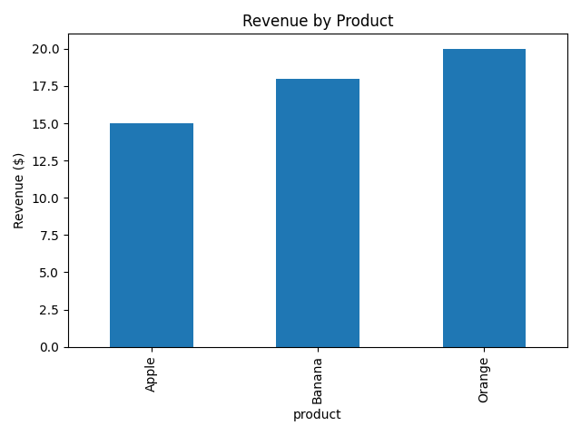

# Task7_sqlite_sales_summary

---

### 📄 `README.md`

```markdown
# 🛒 Sales Summary from SQLite with Python

This project demonstrates how to use **SQLite**, **SQL**, **Pandas**, and **Matplotlib** in Python to generate a simple sales summary from a small database.

## 📌 Features

- Creates a local SQLite database (`sales_data.db`) with sample data
- Uses SQL to summarize sales by product
- Prints a summary table of total quantity and revenue
- Visualizes the results with a basic bar chart

## 🛠️ Technologies Used

- Python 3.x
- SQLite3
- Pandas
- Matplotlib

## 📊 Output

- A printed table of products, total quantities sold, and total revenue
- A bar chart showing revenue by product
- Saved chart image as `sales_chart.png`

## 📁 File Structure

```

task7/
├── task7.py          # Main Python script (runs everything)
├── sales_data.db # Auto-generated SQLite database
├── sales_chart.png   # Auto-generated bar chart
└── README.md         # Project overview and instructions

````

## ▶️ How to Run

1. Clone this repository:
   ```bash
   git clone https://github.com/GAURIPATIL-2004/Task7_sqlite
-sales_summary.git
   cd Task7_sqlite
-sales_summary
````

2. Install dependencies (if needed):

   ```bash
   pip install pandas matplotlib
   ```

3. Run the script:

   ```bash
   python Task7.py
   ```

## 🧠 Key Concepts

* **SQL in Python**: Use SQL queries inside Python scripts for analysis
* **GROUP BY**: Aggregates data (e.g. total quantity and revenue per product)
* **Pandas**: Handles SQL output in an easy-to-use DataFrame
* **Matplotlib**: Plots bar charts for quick visual insights

## 📸 Sample Output

```
Sales Summary:
  product  total_qty  revenue
0   Apple         15      7.5
1  Banana         30      9.0
2  Orange         25     10.0
```



---

## 📬 Questions?

Feel free to open an issue or fork and improve the project.

```

---

